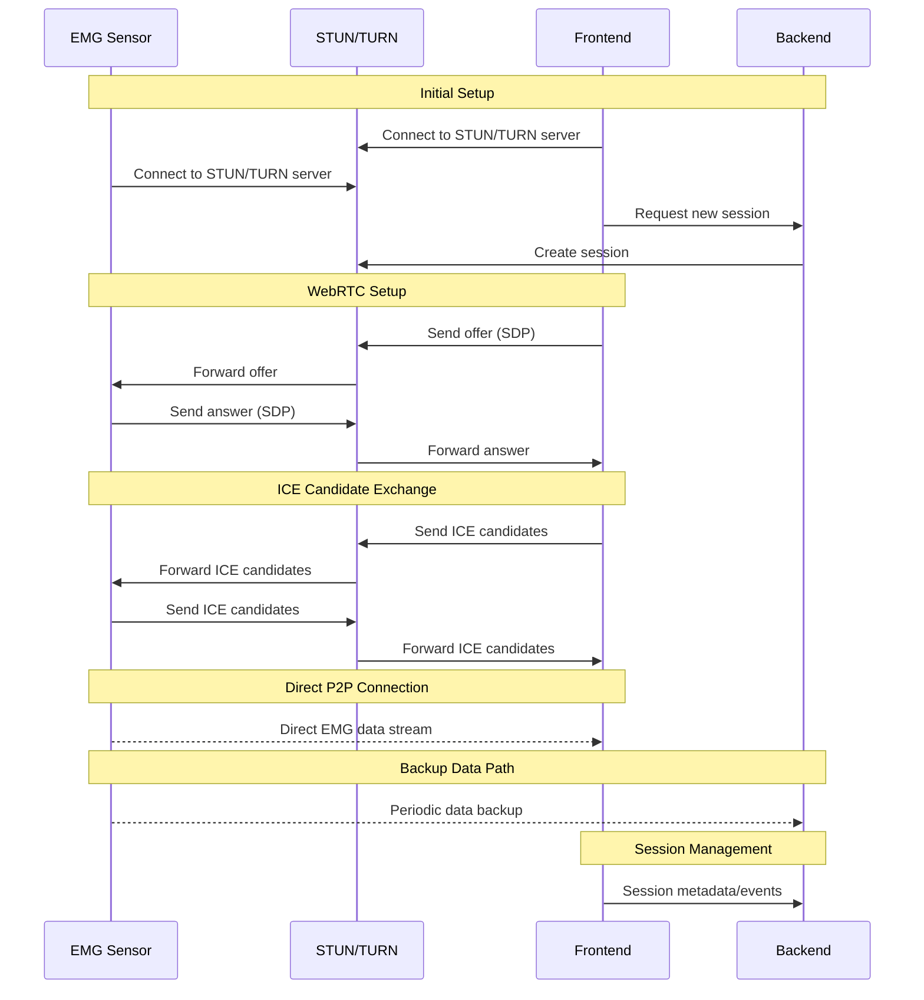
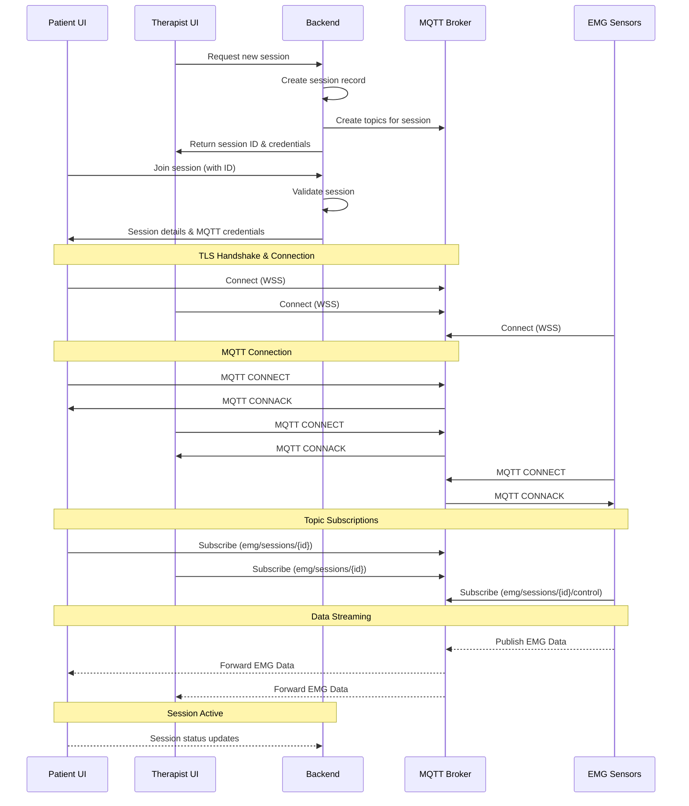

# Live emg sensor data flow

This architectural design record(adr) is focused on discussing the potential flows for the
transmission of emg signal data during a therapy session.

## Option 1: WebRTC based architecture

This option involves using webrtc to establish a direct peer to peer (p2p) connection between the emg sensors
and the front-end to stream live emg data. 

The data flow and architecture can be observed in the diagram below.

### Pros

- Low latency as direct p2p connection is used ,and there is no need for server routing in most cases.
- Reduced load on the server as the server only handles signaling. 
- Built-in security features ensuring data integrity.

### Cons

- More complex to implement
- Overhead complexity as more infrastructure is required.
- Connection recovery is more difficult to achieve
- Webrtc is primarily designed for audio/video transmission which is more complex hence resources may be wasted for emg data transmission.

## Option 2: MQTT over Websockets with TLS

This option uses MQTT over websockets with TLS to stream emg data. 
The architecture diagram can be observed below:

### Pros
- Simpler to implement.
- Improves scalability
- Better suited for IoT data
- Designed for IoT

### Cons
- Higher latency
- Single point of failure. If broker fails data transmission is halted.

## Decision

Due to the nature of the emg data, option 2 has been selected as it is designed for sensor data and still provides
real time data access with the use of websockets.